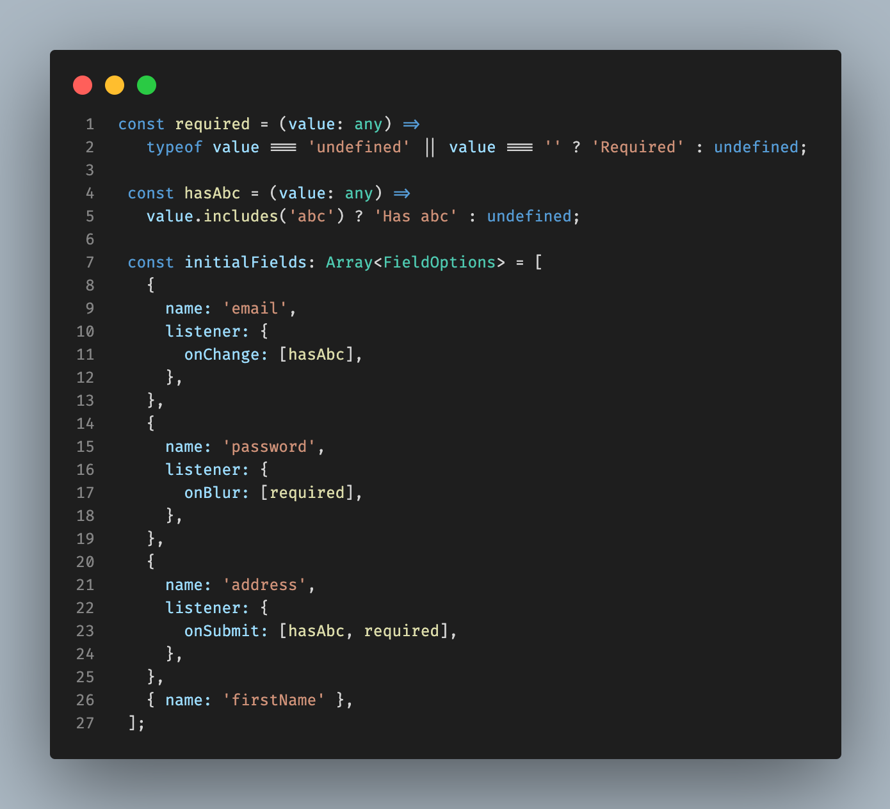
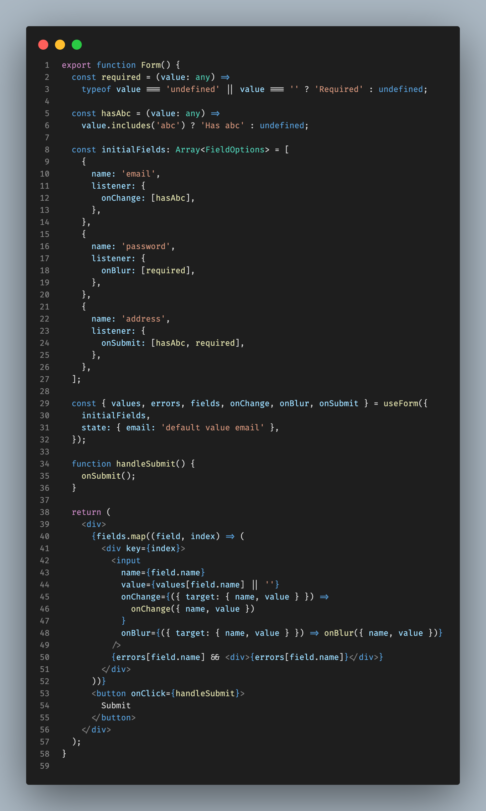

# Use-form

This use-form utility hook aims to facilitate the handling of complex forms validation and form field addition or removal.

## Disclaimer

This is a work in progress tool and mainly aimed at my personal use accross my projects.

### Installation

```bash
npm install @nicolastoulemont/use-form
or
yarn add @nicolastoulemont/use-form
```

### Usage

The useForm hook require a object param containing the fields options array and optionally the initial values.

The field options must include at least a name property but can be expended to include other field related information such as its label, placeholder, type, etc.



The listener object allow the user to insert an array of functions to be executed either on onChange, onBlur or onSubmit. Such functions have access to the field value.

The useForm return a fields array that can then be used as following :



### Api

The useForm hooks returns the following :

- values: The state values as an object.

```typescript
{ [field.name]: value }
```

- setValues: The React dispatch function updating the values state.
- errors: The errors as an object. The return value of the onChange and onBlur listeners functions are stored in the errors state.

```typescript
{ [field.name]: value }
```

- setErrors: The React dispatch function update the errors state.
- onChange: Update the values state and run the field onChange listeners.

```typescript
export interface EventInfos {
  name: string;
  value: any;
}

function onChange(infos: EventInfos) {
  hasSubmitted && setHasSubmitted(false);
  const { name, value } = infos;
  if (errors[name]) setErrors({ ...errors, [name]: undefined });

  setValues({
    ...values,
    [name]: value,
  });

  if (record[name].listener?.onChange) {
    setErrors({
      ...errors,
      [name]: runFns(record[name].listener?.onChange as Array<Function>, value),
    });
  }
}
```

- onBlur: Run the field onBlur listeners.

```typescript
export interface EventInfos {
  name: string;
  value: any;
}

function onBlur(infos: EventInfos) {
  const { name, value } = infos;

  if (record[name].listener?.onBlur) {
    setErrors({
      ...errors,
      [name]: runFns(record[name].listener?.onBlur as Array<Function>, value),
    });
  }
}
```

- onSubmit: Run all the fields onChange and onSubmit listeners. It also return the form validty (boolean) and the errors count.

```typescript
function onSubmit() {
  setHasSubmitted(true);

  let count = 0;
  let submitErrors: { [key: string]: any } = {};

  fields.forEach(field => {
    if (field.listener) {
      const fns = getFns(field.listener);
      const errors = runFns(fns, values[field.name]);
      submitErrors[field.name] = errors;
      if (errors) {
        count++;
      }
    }
  });
  setErrors(submitErrors);
  return [count === 0, count];
}
```

- hasSubmitted (boolean): The submit state of the form. Set to false by the onChange function.
- deleteVal: Helper function to delete a specific value in the values state.

```typescript
function deleteVal(key: string) {
  setValues(values => ({ ...values, [key]: undefined }));
}
```

- deleteErr: Helper function to delete a specific error in the errors state.

```typescript
function deleteErr(key: string) {
  setErrors(errors => ({
    ...errors,
    [key]: undefined,
  }));
}
```

- resetValues: Helper function to reset the values state to an empty object.

```typescript
const resetValues = () => setValues({});
```

- resetErrors: Helper function to reset the errors state to an empty object.

```typescript
const resetErrors = () => setErrors({});
```

- resetForm: Helper function to reset both the errors and values states to an empty object.

```typescript
function resetForm() {
  setErrors({});
  setValues({});
}
```

- removeField: Remove field from the fields array

```typescript
function removeField(name: string) {
  setFields(fields => fields.filter(field => field.name !== name));
}
```

- addField: Add field to the fields array

```typescript
function addField(field: FieldOptions, index: number) {
  const newFields = [...fields.slice(0, index), field, ...fields.slice(index)];
  setFields(newFields);
}
```

- resetFields: Set the fields back to the initialFields array.

```typescript
const resetFields = () => setFields(initialFields);
```

### Built with

- [tsdx](https://github.com/jaredpalmer/tsdx)
- [React](https://github.com/facebook/react)

### Versionning

This tool use [SemVer](http://semver.org/) for versioning.

### Licence

MIT
